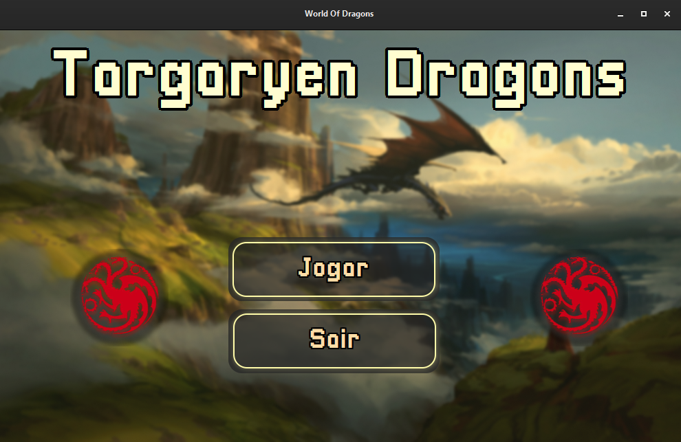

# 🐉 Jogo de Batalha de dragões — Feito em C com Interface Gráfica GTK

Um jogo com batalhas entre dragões, construído com linguagem C e interface gráfica usando GTK. 🐲💥  
Inclui minigames interativos que influenciam o combate!

---

## 📸 Screenshot



---

## 🎮 Funcionalidades

- Interface gráfica moderna com GTK
- Batalha entre dois dragões com barra de vida, ataques, defesas, debuffs...
- Minijogos que afetam o dano dos ataques
- Sons e animações de ataques
- Código modular e comentado

---

## 🧠 Como o jogo funciona

O jogo é dividido em alguns componentes principais:

1. **Interface gráfica (`main.c`)**  
   Contém toda a estrutura principal para rodar a tela e é responsável por integrar toda a parte gráfica com o backend do programa.

2. **Lógica de batalha (`battle_libs.c`)**  
   Gerencia o sistema de turnos, dano, defesa, e estados dos dragões.

3. **Gerenciador de animações (`animation_libs.c`)**  
   Utiliza funções para realizar animações que ocorrem na tela.

4. **Gerenciador de áudios (`audio_libs.c`)**  
   Inicializa a biblioteca, junto com todos os áudios e músicas, e contém a lógica para seu funcionamento.

5. **Gerenciador de arquivos (`files_libs.c`)**  
   É responsável por gerenciar todos os arquivos, seja os atributos dos dragões, saves do jogador.

6. **Gerenciador do jogador (`player_libs.c`)**  
   Contém as funções que alteram os atributos do jogador, como adicionar nível, experiência, e alterar os atributos do dragão jogador.
---

## 📁 Estrutura do Projeto
```
accounts/              # Contém os arquivos de save
├── accountsList.bin   # Arquivo de controle de save
└── saves.bin          # Arquivos de save individuais

assets/                # Arquivos estáticos usados no jogo
├── css/               # Estilos da interface
├── fonts/             # Fontes utilizadas
├── img_files/         # Imagens e animações
├── screenshots/       # Capturas de tela do jogo
├── sounds/            # Efeitos sonoros e músicas
└── ui_files/          # Arquivos .glade da interface GTK

bin/                   # Código-fonte principal do jogo
├── main.c             # Função principal
├── account.c          # Gerencia saves
├── animation_libs.c   # Gerencia animações
├── battle_libs.c      # Mecânicas de combate
├── dlibs.h            # Cabeçalhos e structs
├── files_libs.c       # Manipulação de arquivos
└── player_libs.c      # Atributos e progresso do jogador

files/                 # Dados dos dragões e progressão
├── attacksList.bin
├── beastsList.bin
└── lvls_experience.txt

docs/                  # Documentação do projeto
├── arquitetura.md
├── funcoes.md
└── eventos_gtk.md

lib/                   # Loaders e arquivos GTK
├── loaders/
├── loaders.cache
└── desktop.ini

share/                 # Ícones e temas da interface
├── glib-2.0/
├── themes/
└── icons/

dlls/                  # Dependências DLL para execução no Windows

README.md              # Este arquivo
.gitignore             # Arquivos ignorados pelo Git
```

---

## 🧪 Como Compilar

### 🔧 Requisitos

- Ambiente linux ( Distribuições Linux ou MSYS2 (mingw64) )
- Biblioteca Gtk-3.0, pango, glib, gdk, sdl2, sdl2mixer... 
- Todas as dependências se encontram na pasta "dlls"
- Todos os loaders gtk se encontram na pasta "libs"

### 💻 Comando de compilação:

📌 **Todos os arquivos .c estão na pasta bin.**  

## Compilação sem terminal ( mwindows )
```bash
gcc -o main.exe main.c audio_libs.c animations_libs.c files_libs.c account.c player_libs.c battle_libs.c -mwindows $(pkg-config --cflags --libs gtk+-3.0 glib-2.0 pango) -lSDL2 -lSDL2_mixer
./main.exe
```

## Compilação com terminal
```bash
gcc -o main.exe main.c audio_libs.c animations_libs.c files_libs.c account.c player_libs.c battle_libs.c $(pkg-config --cflags --libs gtk+-3.0 glib-2.0 pango) -lSDL2 -lSDL2_mixer
./main.exe
```

---

## 📚 Documentação Técnica:
- A documentação detalhada está na pasta docs/, incluindo:
- arquitetura.md: estrutura geral dos módulos
- funcoes.md: explicação das funções principais
- eventos_gtk.md: como os sinais e eventos estão conectados

--- 

## 📦 Instalação no Windows
- O projeto acompanha um instalador .exe gerado com Inno Setup.

- Para instalar basta abrir o executavel: "T_Dragons_setup.exe", você pode baixá-lo na seção de releases..
- Siga os passos e instale, marque a opção de criar atalho, e rode o jogo normalmente, ele não precisa de permissões extras para funcionar.

---

## 👨‍💻 Autor
- Desenvolvido por **Dhemerson Sousa**  
🔗 GitHub: [@Rebornned](https://github.com/Rebornned)

--- 

## 📜 Licença
- Este projeto está licenciado sob a [Creative Commons Attribution-NonCommercial 4.0 International (CC BY-NC 4.0)](https://creativecommons.org/licenses/by-nc/4.0/).  
- Consulte o arquivo [`LICENSE`](LICENSE) para mais detalhes.
- 📌 **Este projeto é educativo e não deve ser utilizado com fins comerciais.**  
- Alguns assets (áudios, imagens etc.) não são de minha autoria e foram usados apenas para fins de estudo.

---